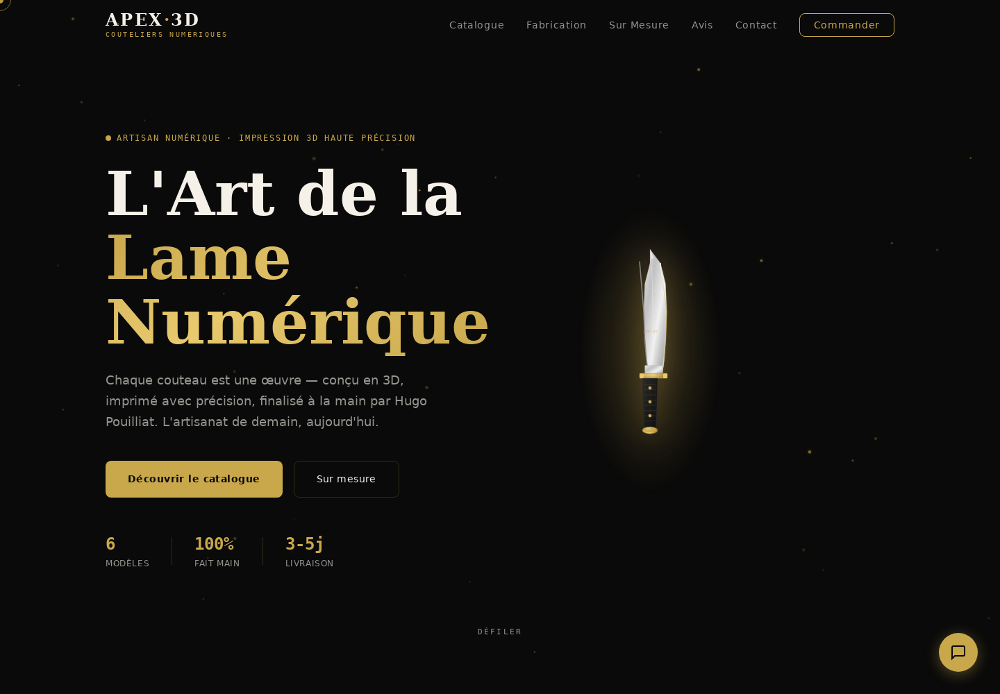
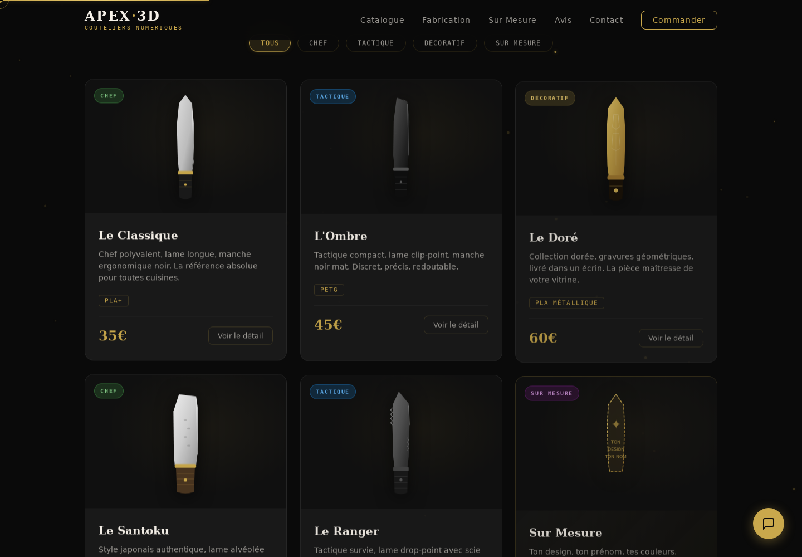

# Apex 3D

Site vitrine en HTML, CSS et JavaScript présentant un catalogue de couteaux imprimés en 3D, le processus de fabrication et une offre sur mesure. La page principale crédite Hugo Pouilliat pour la marque et les créations présentées.


## Aperçu





Pages du site exécuté localement. Le catalogue est une interface statique ; ces captures ne démontrent pas un paiement ou une commande traitée par un serveur.

## Fonctionnalités

- Catalogue filtrable et fiches détaillées des modèles.
- Navigation par sections, menu mobile et animations au défilement.
- Illustration SVG du produit et effets de particules sur Canvas.
- Formulaire de contact et interface de conversation côté navigateur.

## Technologies

HTML5, CSS3 et JavaScript sans framework. Les polices sont chargées depuis Google Fonts. Aucun service de paiement ou backend de commande n’est fourni dans ce dépôt.

## Lancer localement

```bash
git clone https://github.com/Vincent-P-essy/Apex_3D.git
cd Apex_3D
python3 -m http.server 8000
```

Ouvrir <http://localhost:8000>.

## Structure

- `index.html` : site Apex 3D.
- `styles.css` : mise en page et styles responsive.
- `script.js` : catalogue, interactions et animations.
- `portfolio.html` : page de portfolio également conservée dans le dépôt.
